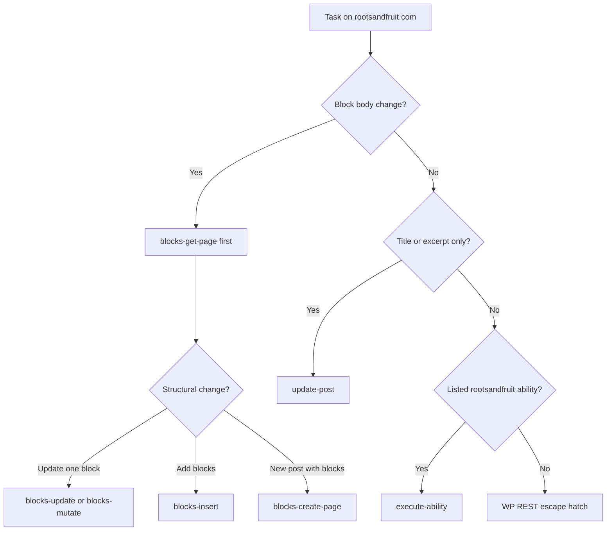

# MCP routing guide — Roots & Fruit

Read this when you need to **choose a tool**, **structure ability parameters**, or **decide MCP vs REST**. For architecture and security model, see `posts/managing-wordpress-via-cursor.md`. For quick rules, see `AGENTS.md`.

---

## Workspace layout

```
rootsandfruit-as-client/
├── agent/       ← this file lives here (Cursor MCP ops)
└── abilities/   ← WordPress plugin repo (github.com/Roots-and-Fruit/abilities)
```

## How Cursor reaches WordPress

```
Cursor chat
  → MCP server: wordpress-rootsandfruit  (.cursor/mcp.json)
    → tools/scripts/run-wordpress-mcp.mjs  (.env credentials)
      → @automattic/mcp-wordpress-remote
        → WordPress MCP Adapter  (/wp-json/mcp/...)
          → mcp-adapter-discover-abilities
          → mcp-adapter-execute-ability   ← primary write path
          → mcp-adapter-get-ability-info
            → WordPress Abilities API
              → rootsandfruit/*  (this plugin)
              → sppopups/*, ai/*, …  (other plugins, if registered)
              → gk-block-mcp services (in-process PHP, not a second MCP)
```

**Do not** add `@gravitykit/block-mcp` as a separate Cursor MCP. Block work goes through `rootsandfruit/blocks-*`.

---

## Credential profiles

| Profile | WP user | Use for | Typical caps |
|---------|---------|---------|--------------|
| **Content agent** | Cursor Agent (custom `agent` role) | Posts, blocks, preview, drafts | `edit_posts`, `publish_posts`, `edit_others_posts`, `upload_files` |
| **Admin** | Administrator | Snippets, plugin updates, robots/llms files | + `unfiltered_html`, `update_plugins`, `update_robots_llms_txt` |

Both use **Application Passwords** in `.env` (`ROOTSANDFRUIT_MCP_*`). Same user = same caps on MCP and REST.

**Discover vs execute:** MCP may list abilities the current user cannot run (e.g. `snippets-*` without `unfiltered_html`). Execution fails at the ability `permission_callback`.

**Prod note:** Confirm agent role caps match intent. `update_plugins` on the content agent enables `plugin-update-safe`.

---

## Decision flow



---

## `rootsandfruit/*` modules (discover for live list)

Run `mcp-adapter-discover-abilities` or `audit-mcp-abilities.ps1` after deploys. Grouping:

| Module | Abilities | Permission basis |
|--------|-----------|------------------|
| Health | `ping`, `purge-breeze-cache` | `read` / `edit_posts` (optional `post_id` → `edit_post`) |
| Discovery | `get-robots-llms-txt`, `update-robots-llms-txt` | `read` / `update_robots_llms_txt` |
| Content | `list-posts`, `get-post`, `create-draft`, `update-post`, `publish-post`, `set-post-author` | `edit_posts` / `edit_post` / `publish_posts` / `edit_others_posts` |
| Preview | `enable-public-preview`, `get-public-preview-url` | `edit_post` (requires Public Post Preview plugin) |
| Blocks | `blocks-get-page`, `blocks-update`, `blocks-mutate`, `blocks-insert`, `blocks-create-page`, `blocks-list-patterns` | `edit_post` (requires `gk-block-mcp`) |
| Snippets | `snippets-list` … `snippets-verify` | `unfiltered_html` |
| Plugins | `plugin-update-safe`, `plugin-update-git-safe` (when Git Updater active) | `update_plugins` |

**Not registered:** post delete.

**Cache purge:** prefer `rootsandfruit/purge-breeze-cache` (server-side, after plugin deploy) or `.\tools\scripts\purge-breeze-cache.ps1` (`BREEZE_TOKEN` in `.env`, Bearer auth). Snippet deploy scripts call purge automatically.

**Git plugin deploy:** `rootsandfruit/plugin-update-git-safe` (after plugin deploy) or `.\tools\scripts\update-git-plugin.ps1` (`GIT_UPDATER_KEY` in `.env`). Git Updater slug may differ from folder name (`abilities` vs `rootsandfruit-abilities`). Use `target_version` or `override` for release-asset plugins; script flushes GU cache and nudges wp-cron first.

**Author:** prefer `rootsandfruit/set-post-author` with optional `purge_breeze: true`; REST fallback in escape hatches section.

---

## Recipes (MCP)

### 1. Health check

```json
{
  "ability_name": "rootsandfruit/ping",
  "parameters": {}
}
```

Expect `plugin_version`, `block_mcp_active: true` when block bridge is live.

### 2. Draft → blocks → preview (safe E2E)

**Step A — create shell draft**

```json
{
  "ability_name": "rootsandfruit/create-draft",
  "parameters": {
    "title": "Agent test draft",
    "excerpt": "Short excerpt for hero."
  }
}
```

**Step B — insert blocks** (empty post: omit position = append)

```json
{
  "ability_name": "rootsandfruit/blocks-insert",
  "parameters": {
    "post_id": 1306,
    "blocks": [
      {
        "name": "core/heading",
        "attributes": { "content": "Section title", "level": 2 },
        "innerHTML": "<h2 class=\"wp-block-heading\">Section title</h2>"
      },
      {
        "name": "core/paragraph",
        "attributes": { "content": "Body copy here." },
        "innerHTML": "<p>Body copy here.</p>"
      }
    ]
  }
}
```

**Required:** `innerHTML` for static blocks. Attributes alone fail with GK validation error.

**Step C — read tree before editing**

```json
{
  "ability_name": "rootsandfruit/blocks-get-page",
  "parameters": { "post_id": 1306 }
}
```

Use returned `ref` values (e.g. `blk_abc63392b`) for targeted edits — stable across the session.

**Step D — mutate one block**

```json
{
  "ability_name": "rootsandfruit/blocks-mutate",
  "parameters": {
    "post_id": 1306,
    "op": "update-attrs",
    "ref": "blk_abc63392b",
    "attributes": { "content": "Updated paragraph text." },
    "innerHTML": "<p>Updated paragraph text.</p>"
  }
}
```

Prefer live writes on **drafts**. Use `dry_run: true` cautiously on empty posts — output schema may reject `revision_id: 0`.

**Step E — set author (when not the MCP user)**

Default article byline on rootsandfruit.com: **user ID `1`**. Use unless the operator specifies another author.

```json
{
  "ability_name": "rootsandfruit/set-post-author",
  "parameters": {
    "post_id": 1306,
    "author": 1,
    "purge_breeze": true
  }
}
```

`author` accepts user ID (integer) or login (string). When `purge_breeze` is true and Breeze is active, cache clears on the server. Otherwise run `.\tools\scripts\purge-breeze-cache.ps1` before sharing logged-out preview URLs.

**Step F — public preview link**

```json
{
  "ability_name": "rootsandfruit/enable-public-preview",
  "parameters": { "post_id": 1306 }
}
```

Returns `preview_url` with `preview=1&_ppp=…`. Test logged out in incognito.

**Step G — title/excerpt only (not block body)**

```json
{
  "ability_name": "rootsandfruit/update-post",
  "parameters": {
    "post_id": 1306,
    "title": "New title",
    "excerpt": "New excerpt"
  }
}
```

`update-post` **rejects** content containing `<!-- wp:` — use `blocks-*` for Gutenberg body.

### 3. Edit existing published post (block-heavy)

1. `blocks-get-page` with `post_id` — note `revision_id` and block `ref`s.
2. Small change via `blocks-mutate` or `blocks-update`.
3. **Ask first** before mutating published content; prefer draft copy for experiments.

### 4. New page with block content

```json
{
  "ability_name": "rootsandfruit/blocks-create-page",
  "parameters": {
    "title": "New landing page",
    "post_type": "page",
    "status": "draft",
    "blocks": [
      {
        "name": "core/heading",
        "attributes": { "content": "Headline", "level": 1 },
        "innerHTML": "<h1 class=\"wp-block-heading\">Headline</h1>"
      }
    ]
  }
}
```

Prefer over `create-draft` when the deliverable is Gutenberg blocks.

### 5. Patterns

```json
{
  "ability_name": "rootsandfruit/blocks-list-patterns",
  "parameters": { "search": "form", "per_page": 10 }
}
```

Check `preference.tier` and `has_legacy_blocks` before inserting Kadence/legacy patterns.

### 6. Update robots.txt / llms.txt (admin credential)

Canonical copies live in `agent/content/discovery/`. Files must already exist on the server (update-only).

**Step A — read current file + sha256**

```json
{
  "ability_name": "rootsandfruit/get-robots-llms-txt",
  "parameters": { "file": "llms" }
}
```

`file`: `robots` | `llms` | `llms-full`.

**Step B — dry run (optional)**

```json
{
  "ability_name": "rootsandfruit/update-robots-llms-txt",
  "parameters": {
    "file": "llms",
    "content": "# Roots & Fruit\n\n> …",
    "expected_sha256": "<sha256 from step A>",
    "dry_run": true
  }
}
```

**Step C — write + purge cache**

```json
{
  "ability_name": "rootsandfruit/update-robots-llms-txt",
  "parameters": {
    "file": "llms",
    "content": "# Roots & Fruit\n\n> …",
    "expected_sha256": "<sha256 from step A>",
    "purge_breeze": true
  }
}
```

Requires `update_robots_llms_txt` (administrator Application Password). On sha mismatch, returns `409` — re-run get and merge.

---

## REST escape hatches

Use when **no ability exists**. Same Application Password as MCP.

### Change post author (REST fallback)

Prefer **`rootsandfruit/set-post-author`** (see recipe Step E). REST fallback when ability unavailable:

```http
POST /wp-json/wp/v2/posts/{id}
Content-Type: application/json

{ "author": 1 }
```

Requires `edit_post` on the post (and typically `edit_others_posts` when reassigning). After change: **purge Breeze cache** — logged-out preview/byline can show stale author.

### Search users (for author ID)

```http
GET /wp-json/wp/v2/users?search=matt
```

Agent user may only see a subset; search often still resolves display names.

### Breeze cache

Logged-out HTML is served from **Breeze page cache**. Logged-in users bypass it.

After author, byline, hero meta, snippet deploy, or publish:

```powershell
# From agent/ — Bearer token from BREEZE_TOKEN in .env
.\tools\scripts\purge-breeze-cache.ps1
```

**MCP (after abilities plugin deploy):**

```json
{
  "ability_name": "rootsandfruit/purge-breeze-cache",
  "parameters": {}
}
```

Optional per-post purge (Breeze 2.4+): `{ "post_id": 123 }`.

**set-post-author** accepts `purge_breeze: true` to purge on the server in the same call. If the response has `breeze_purge_reminder: true`, run the script above.

Do not share public preview URLs until logged-out view matches.

---

## Anti-patterns

| Don't | Do instead |
|-------|------------|
| Paste `<!-- wp:paragraph -->` HTML via `update-post` | `blocks-insert` / `blocks-mutate` |
| Insert blocks with attributes only | Include matching `innerHTML` |
| Assume discover = can execute | Check permission errors; switch creds |
| Edit published posts without asking | Draft E2E first |
| Use REST for routine block edits | MCP `blocks-*` (schemas + GK bridge) |
| Add second GravityKit Node MCP | Keep single `wordpress-rootsandfruit` MCP |
| Trust logged-out preview immediately after meta change | Purge Breeze, re-check incognito |

---

## Third-party abilities on the same MCP

Discover may also return tools from other plugins, e.g.:

- `sppopups/*` — popup/synced pattern helpers
- `ai/*` — AI connector abilities (alt text, post details)

Treat these as **separate owners**. Prefer `rootsandfruit/*` for R&F content workflows unless the task explicitly needs them.

---

## Verification after routing changes

```powershell
.\tools\scripts\test-wordpress-mcp-http.ps1 -ExpectRfAbilities -ExpectBlocks
.\tools\scripts\audit-mcp-abilities.ps1 -ExpectBlocks
```

For a full block write path: draft → insert → get-page → mutate → enable-public-preview → confirm logged-out preview.

---

## When to add a new ability vs REST

Add to `rootsandfruit-abilities` when:

- The operation will be repeated by agents
- You need schema validation, guardrails, or composite workflow
- REST is too easy to misuse (author change, cache purge, meta bulk ops)

Keep REST when:

- One-off admin task
- Core endpoint already sufficient and low-risk
- Prototype before promoting to ability
